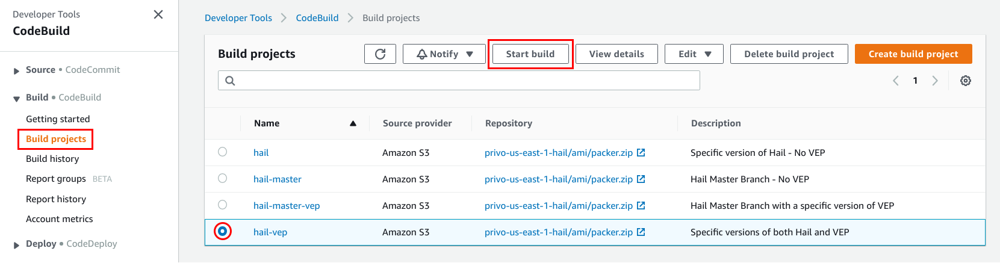
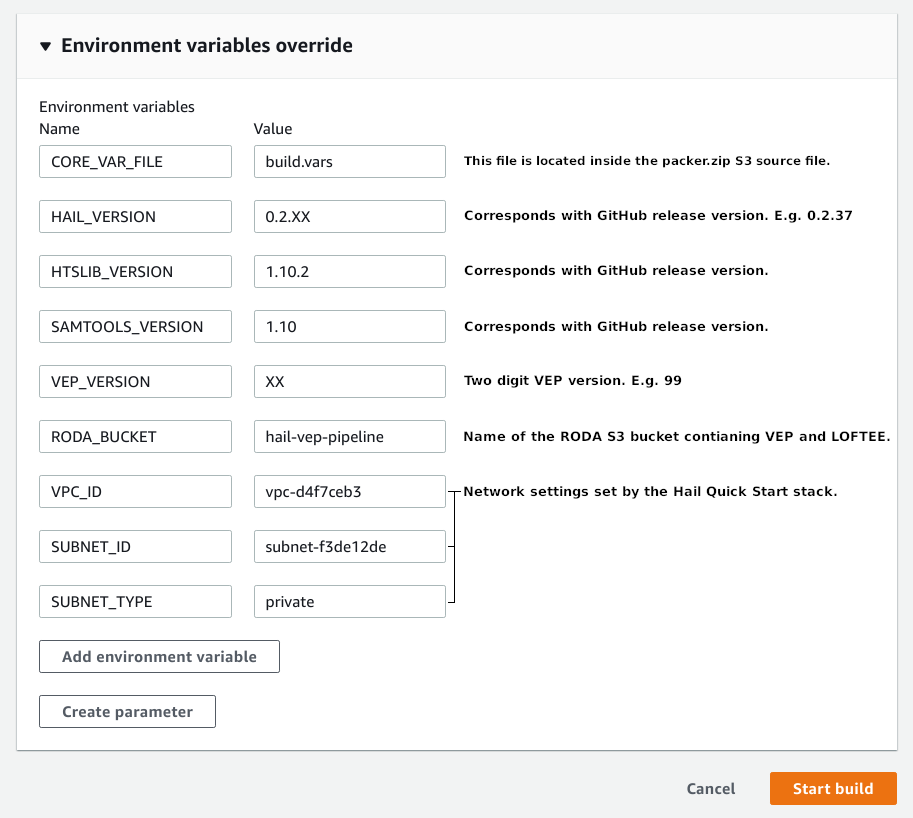
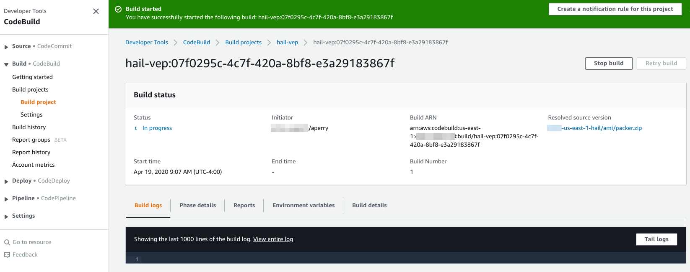
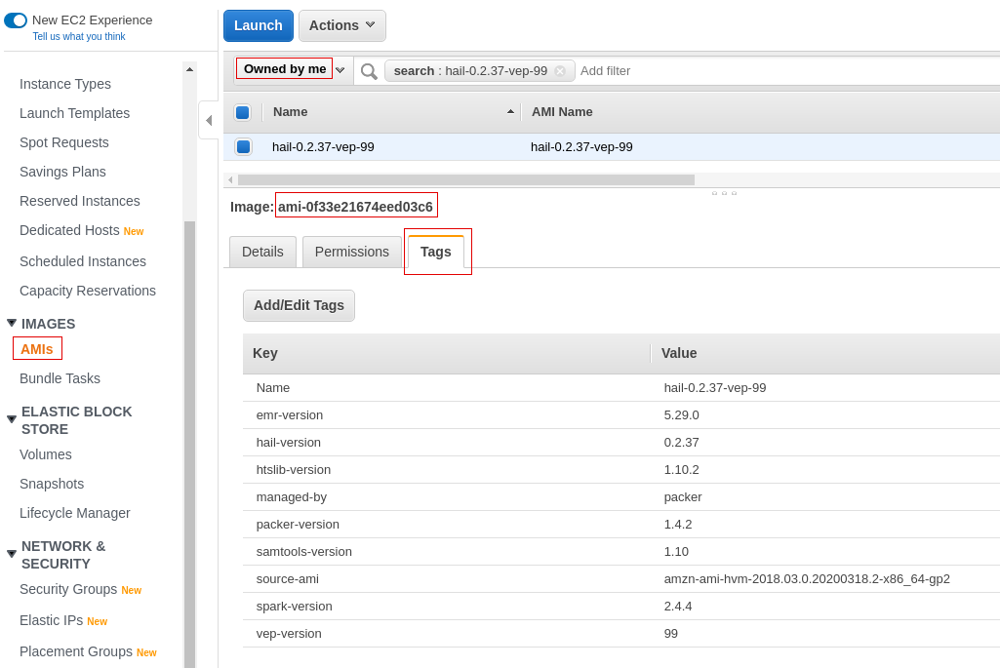

# Hail AMI Creation via AWS CodeBuild

The Quick Start creates AWS CodeBuild Projects that allow AMI creation with specific combinations of [Hail](https://hail.is), [Spark](https://docs.aws.amazon.com/emr/latest/ReleaseGuide/emr-spark.html), and [VEP](https://useast.ensembl.org/info/docs/tools/vep/index.html).

The build process leverages [Packer](https://www.packer.io) for AMI creation.  As part of the Quick Start deployment, your Hail bucket is seeded with a zip file of the Quick Start's `packer` folder.  This zip contains a JSON build template, variables file, and scripts to execute during the build process.

Builds may optionally include [VEP](https://useast.ensembl.org/info/docs/tools/vep/index.html) and [LOFTEE](https://github.com/konradjk/loftee).  VEP and LOFTEE are taken from the [Registry of Open Data on AWS](https://registry.opendata.aws/hail-vep-pipeline/) and added to the AMI.  The following species are included:

- Zebrafish (Danio rerio) [GRCz11](http://uswest.ensembl.org/Danio_rerio/Info/Index)
- Human (Homo sapiens) [GRCh38](http://uswest.ensembl.org/Homo_sapiens/Info/Index)
- Human (Homo sapiens) [GRCh37](https://grch37.ensembl.org/Homo_sapiens/Info/Index)
- Rat (Rattus norvegicus) [Rnor_6.0](https://uswest.ensembl.org/Rattus_norvegicus/Info/Index)

## Table of Contents

- [Hail AMI Creation via AWS CodeBuild](#hail-ami-creation-via-aws-codebuild)
  - [Table of Contents](#table-of-contents)
  - [Building](#building)
  - [Customization](#customization)

## Building

Before building, keep the following in mind:

- Hail builds may take up to 30 minutes.  Builds with VEP may take upwards of 120 minutes.
- AMI names are unique.  If building an updated AMI for a pre-existing configuration, de-register the previous.

From the AWS CodeBuild dashboard, select **Build projects** then the desired build's radio button and click **Start build**.

On the next page open the **Environment variable override** section and enter values specific to your build.

The `VEP_VERSION` identifies the version of VEP the build will use from the `RODA_BUCKET`. The Hail and VEP versions should be explicitly set on each build.  Other variables should not require adjustments from the defaults, but may be overridden for customization.

Once the build begins you can optionally tail logs to view progress.  Closing this window will not terminate the build.

Once the build completes the AMI will be listed in the EC2 dashboard's AMI pane.  Once in the AMI pane, select `Owned By Me` to limit AMIs to your account.  Note that the Hail AMI tags will reference many of the environment variables set during the build process.

Use the AMI ID in the `Custom AMI` field when deploying your Hail Cluster.

## Customization

Builds may be further customized by expanding upon the contents of the packer directory.  After making changes to this directory on your local system, zip the `packer` directory and upload it to `s3://<YOUR_HAIL_BUCKET>/ami/packer.zip`.  Executing a new build will use the updated zip as the build source.
